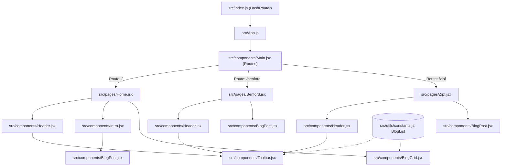

# Code Map: Zach's Personal Website & Blog

Welcome to the codebase map for **[zachwebsite](file:///home/zdiaks/projects/Website)**. This document provides an architectural overview, file-by-file breakdown, component hierarchy, routing model, styling system, and instructions for adding new content.

---

## 1. Project Overview & Tech Stack

The project is a personal portfolio and mathematical/technical blog built as a single-page application (SPA) deployed to GitHub Pages.

- **Framework**: [React 18](https://react.dev/) (bootstrapped with Create React App)
- **Routing**: [`react-router-dom` v7](https://reactrouter.com/) using `HashRouter` (ensures stable routing on static hosting without server rewrite rules)
- **Markdown & Math**: 
  - [`react-markdown`](https://github.com/remarkjs/react-markdown) for parsing markdown content
  - [`remark-gfm`](https://github.com/remarkjs/remark-gfm) for GitHub-Flavored Markdown (tables, autolinks, task lists)
  - [`remark-math`](https://github.com/remarkjs/remark-math) & [`rehype-katex`](https://github.com/remarkjs/rehype-katex) with [`katex`](https://katex.org/) for LaTeX mathematical formulas
- **Styling**: Vanilla CSS utilizing custom CSS properties based on a dark Monokai-inspired color palette
- **Deployment**: [`gh-pages`](https://www.npmjs.com/package/gh-pages) deploying static artifacts from `build/` to GitHub Pages at `https://zachdiaks.github.io/Website/`

---

## 2. Directory Tree

```
/home/zdiaks/projects/Website/
├── CODEMAP.md                     # Codebase map and architecture reference (this file)
├── package.json                   # Dependencies, scripts, and deployment config
├── package-lock.json              # Locked dependency tree
├── README.md                      # Basic repo description and deployment commands
├── public/                        # Static HTML shell and manifest
│   ├── index.html                 # HTML template mounting #root
│   ├── manifest.json              # Web app metadata
│   └── robots.txt                 # Search crawler rules
└── src/                           # Application source code
    ├── index.js                   # Main application entry point (HashRouter setup)
    ├── index.css                  # Global base reset and typography styles
    ├── App.js                     # Root wrapper loading global styles and Main router
    ├── App.css                    # Theme color tokens (:root) and body typography
    ├── reportWebVitals.js         # Web vitals metrics utility
    ├── setupTests.js              # Testing setup with jest-dom matchers
    ├── __tests__/                 # Unit and integration test suites
    │   └── App.test.js            # Initial App smoke test
    ├── components/                # Modular reusable UI components
    │   ├── Main.jsx               # Route definitions (<Routes> / <Route>)
    │   ├── Header.jsx             # Top-level header container
    │   ├── Header.css             # Header container styles
    │   ├── Toolbar.jsx            # Navigation bar with dynamic dropdown
    │   ├── Toolbar.css            # Navigation bar layout and dropdown styling
    │   ├── Intro.jsx              # Welcome markdown section for Home page
    │   ├── BlogGrid.jsx           # Dynamic card grid displaying blog posts
    │   ├── BlogGrid.css           # Responsive grid layout and card hover effects
    │   ├── BlogPost.jsx           # Universal Markdown + LaTeX KaTeX renderer
    │   ├── BlogPost.css           # Typography, math tables, and image styles for blogs
    │   └── Panel.jsx              # Placeholder for collapsible drawer/panel UI
    ├── pages/                     # High-level page views
    │   ├── Home.jsx               # Landing page (Header + Intro + BlogGrid)
    │   ├── Benford.jsx            # Blog post: Benford's Law & documentation analysis
    │   └── Zipf.jsx               # Blog post: Zipf's Law & text analysis (in-progress)
    ├── resources/                 # Static media and assets
    │   ├── BenfordResult.png      # Benford's Law distribution plot
    │   ├── ZipfResult.png         # Zipf's Law frequency plot
    │   ├── ZachProfPic.jpg        # Profile image asset
    │   └── resume.pdf             # Resume asset referenced in Toolbar
    └── utils/                     # Shared constants and utility functions
        ├── constants.js           # Central metadata registry for blog articles (BlogList)
        └── AsyncUtils.js          # Polling utility (waitFor)
```

---

## 3. Component Architecture & Data Flow

### Visual Component Hierarchy



### Component Details

| Component | File Path | Purpose & Responsibilities |
| :--- | :--- | :--- |
| **`App`** | [`src/App.js`](file:///home/zdiaks/projects/Website/src/App.js) | Wraps the entire application; loads `App.css` and `katex/dist/katex.min.css`; renders `Main`. |
| **`Main`** | [`src/components/Main.jsx`](file:///home/zdiaks/projects/Website/src/components/Main.jsx) | Declares the route switches (`/`, `/benford`, `/zipf`) using React Router. |
| **`Header`** | [`src/components/Header.jsx`](file:///home/zdiaks/projects/Website/src/components/Header.jsx) | Structural container holding the `Toolbar` across all page views. |
| **`Toolbar`** | [`src/components/Toolbar.jsx`](file:///home/zdiaks/projects/Website/src/components/Toolbar.jsx) | Navigation bar containing links to Home, external profiles (GitHub, Resume, LinkedIn), and a hover-triggered dropdown menu populating blog links from `BlogList`. |
| **`Intro`** | [`src/components/Intro.jsx`](file:///home/zdiaks/projects/Website/src/components/Intro.jsx) | Contains introductory markdown copy and feeds it to `BlogPost`. |
| **`BlogGrid`** | [`src/components/BlogGrid.jsx`](file:///home/zdiaks/projects/Website/src/components/BlogGrid.jsx) | Reads `BlogList` from `constants.js` and renders clickable thumbnail cards linking to corresponding routes. |
| **`BlogPost`** | [`src/components/BlogPost.jsx`](file:///home/zdiaks/projects/Website/src/components/BlogPost.jsx) | Markdown rendering engine equipped with `remarkMath`, `rehypeKatex`, and `remarkGfm` for LaTeX formulas, tables, and typography. |
| **`Panel`** | [`src/components/Panel.jsx`](file:///home/zdiaks/projects/Website/src/components/Panel.jsx) | Stub component for an upcoming collapsible panel. |

---

## 4. Pages & Routing

All routes are hash-based (`/#/...`) via [`HashRouter`](file:///home/zdiaks/projects/Website/src/index.js#L10) to support GitHub Pages hosting without requiring specialized server redirects (such as 404.html hacks).

| Path | Page Component | Description |
| :--- | :--- | :--- |
| `#/` | [`Home`](file:///home/zdiaks/projects/Website/src/pages/Home.jsx) | Main landing page: displays the header, personal intro, and interactive blog post grid. |
| `#/benford` | [`Benford`](file:///home/zdiaks/projects/Website/src/pages/Benford.jsx) | Complete technical post investigating Benford's Law on MATLAB documentation scraped with Playwright, featuring math formulas, histograms, and statistical tests (MAD vs Chi-Square). |
| `#/zipf` | [`Zipf`](file:///home/zdiaks/projects/Website/src/pages/Zipf.jsx) | Second installment discussing Zipf's Law analysis (preview/in progress). |

---

## 5. Centralized State & Metadata

### Blog Registry ([`src/utils/constants.js`](file:///home/zdiaks/projects/Website/src/utils/constants.js))

The list of active blog articles is declared centrally:

```javascript
export const BlogList = [
  {
    path: "benford",
    name: "Power Laws and Web Scraping: Benford's Law",
    thumbnail: "BenfordResult.png",
    tags: ["Math"]
  },
  {
    path: "zipf",
    name: "Power Laws and Web Scraping: Zipf's Law",
    thumbnail: "ZipfResult.png",
    tags: ["Math"]
  }
];
```

This array powers:
1. The **navigation dropdown menu** in [`Toolbar.jsx`](file:///home/zdiaks/projects/Website/src/components/Toolbar.jsx#L46-L48).
2. The **visual card grid and interactive tag filtering** in [`BlogGrid.jsx`](file:///home/zdiaks/projects/Website/src/components/BlogGrid.jsx), allowing users to filter posts by tag pills (e.g., "All", "Math") and view tag badges on cards.

### Utilities

- **[`AsyncUtils.js`](file:///home/zdiaks/projects/Website/src/utils/AsyncUtils.js)**: Provides `AsyncUtils.waitFor(conditionFunction, timeout, interval)`, an asynchronous polling helper that repeatedly checks a predicate until satisfied or timed out.

---

## 6. Styling & Design System

The application uses Monokai-inspired dark theme CSS variables defined in [`src/App.css`](file:///home/zdiaks/projects/Website/src/App.css#L7-L17):

| Token | Hex Value | Used For |
| :--- | :--- | :--- |
| `--bg-color` | `#272822` | Global page background |
| `--text-color` | `#F8F8F2` | Primary foreground text |
| `--toolbar-color` | `#1E1F1C` | Navbar background and default card background |
| `--dropdown-bg-color` | `#2F3129` | Expanded dropdown background |
| `--link-color` | `#66D9EF` | Normal link state (cyan) |
| `--link-hover-color` | `#A6E22E` | Hovered link state (green) |
| `--accent-color` | `#FD971F` | Accent highlights (orange) |
| `--muted-text` | `#75715E` | Secondary/muted copy |
| `--error-color` | `#F92672` | Error states and highlights (magenta) |

### Key CSS Files:
- [`src/App.css`](file:///home/zdiaks/projects/Website/src/App.css): Global variables, body background, and link color defaults.
- [`src/components/Toolbar.css`](file:///home/zdiaks/projects/Website/src/components/Toolbar.css): Flexbox horizontal layout, gap spacing, and dropdown classes (`.BlogDropdown` and `.BlogDropdown-Expanded`).
- [`src/components/BlogGrid.css`](file:///home/zdiaks/projects/Website/src/components/BlogGrid.css): Responsive CSS Grid (`repeat(auto-fit, minmax(250px, 1fr))`), square aspect ratios, scaling hover transitions.
- [`src/components/BlogPost.css`](file:///home/zdiaks/projects/Website/src/components/BlogPost.css): Markdown content container, blockquote formatting with accent borders, centered image styling, and responsive table layout.

---

## 7. How-To: Adding a New Blog Post

To add a new article to the site, follow these 4 steps:

1. **Add Thumbnail Asset**:
   Place thumbnail image (e.g. `NewPostThumb.png`) in [`src/resources/`](file:///home/zdiaks/projects/Website/src/resources/).

2. **Register in `constants.js`**:
   Add the entry to `BlogList` in [`src/utils/constants.js`](file:///home/zdiaks/projects/Website/src/utils/constants.js):
   ```javascript
   {
       path: "new-post",
       name: "Your Post Title",
       thumbnail: "NewPostThumb.png",
       tags: ["Math", "Tutorial"]
   }
   ```

3. **Create the Page Component**:
   Create `src/pages/NewPost.jsx`:
   ```jsx
   import BlogPost from '../components/BlogPost'
   import Header from '../components/Header'

   export default function NewPost() {
       const markdownString = `
   # Your Post Title
   ---
   Write markdown and math here: $E = mc^2$
   `
       return (
           <div>
               <Header />
               <BlogPost contents={markdownString}/>
           </div>
       )
   }
   ```

4. **Register the Route**:
   Import `NewPost` in [`src/components/Main.jsx`](file:///home/zdiaks/projects/Website/src/components/Main.jsx) and add the route:
   ```jsx
   <Route path="/new-post" element={<NewPost />} />
   ```

---

## 8. Available Scripts & Deployment

In the project root, you can run:

- **`npm start`**: Runs the development server at [http://localhost:3000](http://localhost:3000) with hot reloading.
- **`npm run build`**: Compiles production assets into the `build/` directory with code minification and asset hashing.
- **`npm test`**: Runs the Jest test runner via React Scripts.
- **`npm run deploy`**: Runs `predeploy` (`npm run build`) and publishes the `build/` folder to the `gh-pages` branch on GitHub.
